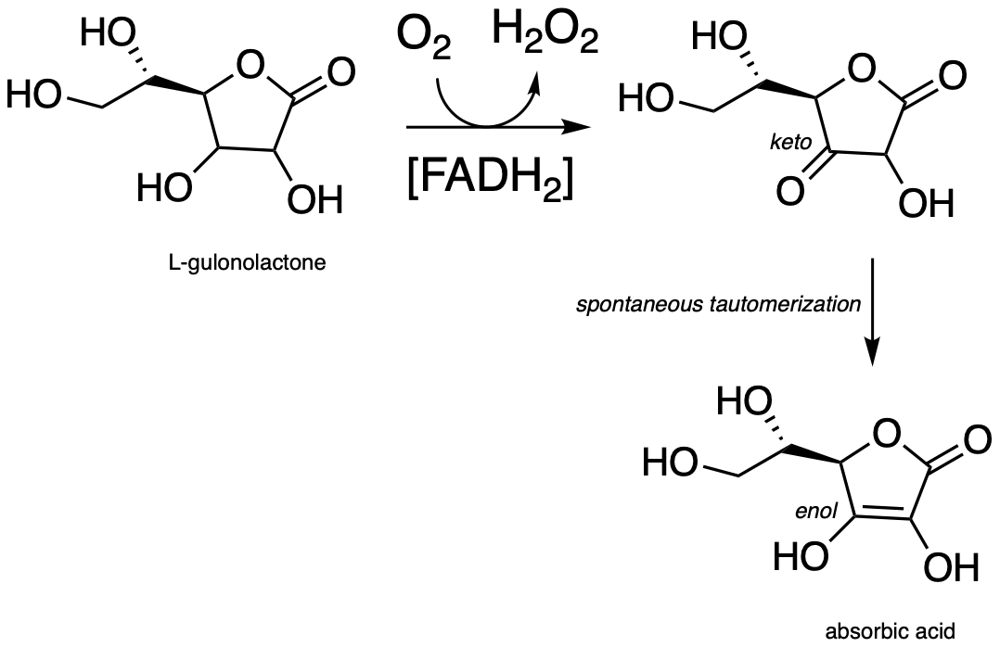
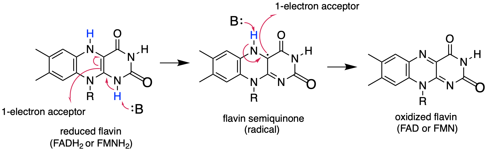

# 16: Free radical reactions

photo credit: https://www.flickr.com/photos/stevehopson/

**Introduction**

Imagine that you are an 18th century British sailor about set out with
Commodore George Anson to raid Spanish shipping fleets in the Pacific.
You know full well that you are signing up for a long and arduous
ordeal, with months of constant seasickness, bad food, cramped,
unsanitary conditions, and brutal warfare. You are mentally ready for
these hardships, but what you are not prepared for is to watch your own
body rot away – to literally fall apart.

Below is a description of the suffering endured by many sailors of the
time:

> Some lost their very substance and their legs became swollen and
> puffed up while the sinews contracted and turned coal-black and, in
> some cases, all blotched with drops of purplish blood. Then the
> disease would creep up to the hips, thighs and shoulders, arms and
> neck. And all the sick had their mouths so tainted and their gums so
> decayed that the flesh peeled off down to the roots of their teeth,
> which almost all fell out. . .

There were devastating neurological as well as physiological effects.
Scurvy had the ability to inhibit a person's normal restraints on
emotion: they became intensely homesick and nostalgic, wept at the
slightest disappointment, and screamed in agony upon smelling the scent
of flower blossoms drifting across the water from a nearby shore.

The disease afflicting the sailors was scurvy, which we now know is
caused by a deficiency of vitamin C in the diet. European sea voyagers
in the 18th century and earlier subsisted mainly on a diet of salted
meat, hard biscuits, pea soup, oatmeal, and beer. After the first couple
of weeks at sea, fresh fruits and vegetables - and the nutrients they
contained – were all consumed or spoiled. The salted meat and hardtack
diet provided salt and calories, but little else of nutritional value.

Although it is rare now, scurvy has plagued sailors for centuries, with
records of its occurrence on ships going back as far as the 15th century
voyages of Magellan and Vasco de Gama, both of whom lost up to three
quarters of their crew to the disease on long ocean crossings. Various
cultures made the connection between scurvy and diet, and learned
effective preventative measures: sailors with the 16th century French
explorer Jacques Cartier, for example, were cured of their scurvy upon
arriving in Canada and taking the advice of native people to eat the
leaves and bark of pine trees. These were lessons, unfortunately, that
often had to be relearned time and again, as the knowledge gained by one
culture was not effectively recorded and passed along to others.

Vitamin C, or ascorbic acid as it is known to chemists, plays an
essential helping role in a variety of essential biochemical reactions.
Most living things are able to synthesize ascorbic acid – the exceptions
include humans and other higher primates, several species of bats, and
some rodents such as guinea pigs and capybaras. Humans lack the last
enzyme in the ascorbic acid biosynthetic pathway, L-gulonolactone
oxidase. (EC 1.1.3.8) (You were invited to propose the mechanism for
this redox reaction in problem 15.10).

fig 1a

Because we cannot make our own ascorbic acid, we need to get it in our
diet. It is abundant in many plant-based foods, citrus fruits in
particular. The traditional diet of the Inuit people of the arctic
region contains virtually no plant products, but vitamin C is obtained
from foods such as kelp, caribou livers, and whale skin. For a time in
the 18th century, the observation that citrus fruits quickly
cured scurvy led to the practice of including in a ship's stores a paste
prepared from boiled lemon juice. Unfortunately, ascorbic acid did not
survive the boiling process, rendering the paste ineffective against
scurvy. Captain James Cook, the legendary explorer and the first
European to make it to the east coast of Australia and the Hawaiian
islands, brought along sourkraut (fermented cabbage), a somewhat more
effective vitamin C supplement. According to his own account, Cook's
sailors at first refused to eat the pungent preparation, so the captain
engaged in a little psychological trickery: he declared that it would
only be served to officers. The enlisted sailors quickly took offense,
and demanded their own sourkraut ration. Later, the British navy
famously adopted the practice of adding lemon or lime juice to their
ships' rum rations, leading to the birth of the slang term 'Limey' used
by European and American sailors to refer to their British counterparts.

\*\*\*

The biochemical role of ascorbic acid is to facilitate the transfer of
*single electrons* in a variety of redox reactions - note here the
emphasis on *single* electrons, as opposed to the redox reactions we
studied in chapter 15 in which electrons were transferred in *pairs*.
The subject of this chapter is single-electron chemistry, and the free
radical intermediates that are involved in single electron reaction
steps.

Later in this chapter we will learn the chemical details of why ascorbic
acid deficiency causes scurvy, how the act of breathing makes you get
old, how polystyrene packing foam is made, and other interesting
applications of single-electron chemistry. But first we need to cover
some basics ideas about single electron chemical steps, and the free
radical intermediates that result from them.

## Section 16.1: Overview of single-electron reactions and free radicals

Beginning with acid-base reactions in chapter x and continuing though
the chapters on nucleophilic substitution, carbonyl addition, acyl
substitution, α-carbon chemistry, and electrophilic reactions , we have
been studying reaction mechanisms in which *both* electrons in a
covalent bond or lone pair move in the *same* direction. In this
chapter, we learn about reactions in which the key steps involve the
movement of *single* electrons. Single electron movement is depicted by
single-barbed **'fish-hook'** arrows (as opposed to the familiar
double-barbed arrows that we have been using throughout the book to show
two-electron movement).

fig 1

Single-electron mechanisms involve the formation and subsequent reaction
of **free radical** species, highly unstable intermediates that contain
an unpaired electron. Free radicals are often formed from **homolytic
cleavage**, an event in which the two electrons in a breaking covalent
bond move in *opposite* directions. The bond in molecular chlorine, for
example, is subject to homolytic cleavage when chlorine is subjected to
heat or light. The result is two chlorine radicals. Note that each
radical has a formal charge of zero.

fig 2

In contrast, essentially all of the reactions we have studied up to now
involve bond-breaking events in which both electrons move in the same
direction: this is called **heterolytic cleavage**.

fig 3

Two other homolytic cleavage reactions that we will see in this chapter
can be described as 'radical hydrogen atom abstraction' and 'radical
alkene addition':

fig 4

Single-electron reaction mechanisms involve the formation of radical
species, and in organic reactions these are often carbon radicals. A
carbon radical is *sp2* hybridized, with three σ bonds
arranged in trigonal planar geometry and the single unpaired electron
occupying an unhybridized *p* orbital. Contrast this picture with a
carbocation reactive intermediate, which is also *sp2*
hybridized with trigonal planar geometry but with an *empty* *p*
orbital.

fig 5

When we studied electrophilic reactions in chapter 14, a major concern
when evaluating possible mechanisms was the stability of any carbocation
intermediate(s). Likewise, the stability of proposed radical
intermediates is of great importance when evaluating the likelihood of
possible single-electron mechanisms. Fortunately, the trend in the
stability of carbon radicals parallels that of carbocations (section
8.5): tertiary radicals, for example, are more stable than secondary
radicals, followed by primary and methyl radicals. This should make
intuitive sense, because radicals, like carbocations, are electron
deficient, and thus are stabilized by the electron-donating effects of
nearby alkyl groups.

fig 6

Benzylic and allylic radicals are more stable than alkyl radicals due to
resonance effects - an unpaired electron (just like a positive or
negative charge) can be delocalized over a system of conjugated π bonds.
An allylic radical, for example, can be pictured as a system of three
parallel *p* orbitals sharing three electrons.

fig 7

The drawing below shows how a benzylic radical is delocalized to three
additional carbons around the aromatic ring:

fig 8

<u>Exercise 16.1</u>: Just as phenolate ions are less reactive (less
basic) than alkoxide ions, phenolic radicals are less reactive than
alkoxide radicals. Draw one resonance contributor of a phenolic radical
showing how the radical electron is delocalized to a ring carbon.
Include electron-movement arrows.

>  style="width:0.76875in;height:0.61111in" />

While radical species are almost always very reactive and short-lived,
in some extreme cases they can be unreactive. One example of an inert
organic radical structure is shown below.

fig 10

The already extensive benzylic resonance stabilization is further
enhanced by the fact that the large electron clouds on the chlorine
atoms shield the radical center from external reagents. The radical is,
in some sense, inside a protective 'cage'.

<u>Exercise 16.2</u>: Draw a resonance contributor of the structure
above in which the unpaired electron is formally located on a chlorine
atom (include electron movement arrows)

## Section 16.2: Radical chain reactions

Because of their high reactivity, free radicals have the potential to be
extremely powerful chemical tools - but as we will see in this chapter,
they can also be extremely harmful in a biological/environmental
context. Key to understanding many types of radical reactions is the
idea of a **radical chain reaction**.

Radical chain reactions have three distinct phases: initiation,
propagation, and termination. We'll use a well-known example, the
halogenation of an alkane such as ethane, to illustrate. The overall
reaction is:

fig 11

The **initiation** phase in a radical chain reaction involves the
homolytic cleavage of a weak single bond in a non-radical compound,
resulting in two radical species as products.

Often, heat or light provides the energy necessary to overcome an energy
barrier for this type of event. The initiation step in alkane
halogenation is homolysis of molecular chlorine (Cl2) into
two chlorine radicals. Keep in mind that that virtually all radical
species, chlorine radicals included, are highly reactive.

fig12

The **propagation** phase is the 'chain' part of chain reactions.

fig 13

Once a reactive free radical (chlorine radical in our example) is
generated in the initiation phase, it will react with relatively stable,
non-radical compounds to form a new radical species. In ethane
halogenation, a chlorine radical generated in the initiation step first
reacts with ethane in a hydrogen abstraction step, generating HCl and an
ethyl radical (part a above). Then, the ethyl radical reacts with
another (non-radical) Cl2 molecule, forming the chloroethane
product and regenerating a chlorine radical (part b above). This process
repeats itself again and again, as chlorine radicals formed in part (b)
react with additional ethane molecules as in part (a).

The **termination** phase is a **radical combination** step, where two
radical species happen to collide and react with each other to form a
non-radical product and 'break the chain'. In our ethane chlorination
example, one possible termination event is the reaction of a chlorine
radical with an ethyl radical to form chloroethane.

fig 14

<u>Exercise 16.3</u>: Draw two alternative chain termination steps in
the ethane chlorination chain reaction. Which one leads to an undesired
product?

Because radical species are so reactive and short-lived, their
concentration in the reaction mixture at any given time is very low
compared to the non-radical components such as ethane and
Cl2. Thus, many cycles of the chain typically occur before a
termination event takes place. In other words, a single initiation event
leads to the formation of many product molecules.

Compounds which readily undergo homolytic cleavage to generate radicals
are called **radical initiators**. As we have just seen, molecular
chlorine and bromine will readily undergo homolytic cleavage to form
radicals when subjected to heat or light. Other commonly used as radical
initiators are peroxides and *N*-bromosuccinimide (NBS).

fig 15

## Section 16.3: Useful polymers formed by radical chain reactions

Many familiar household materials polymers made from radical chain
reaction processes. Polyethylene (PET), the plastic material used to
make soft drink bottles and many other kinds of packaging, is produced
by the radical polymerization of ethylene (ethylene is a common name for
what we call 'ethene' in IUPAC nomenclature). The process begins when a
radical initiator such as benzoyl peroxide undergoes homolytic cleavage
at high temperature:

fig 16

In the propagation phase, the benzoyl radical (X• in the figure below)
adds to the double bond of ethylene, generating a new organic radical.

fig 17

Successive ethylene molecules add to the growing polymer, until
termination occurs when two radicals happen to collide.

fig 18

The length of the polymer is governed by how long the propagation phase
continues before termination, and can usually be controlled by adjusting
reaction conditions.

Other small substituted alkene monomers polymerize in a similar fashion
to form familiar polymer materials. Two examples are given below.

fig 19

<u>Exercise 16.4:</u> Show a mechanism for the formation of a 2-unit
long section of polystyrene, starting with the monomer and benzoyl
peroxide initiator. Keep in mind the relative stability of different
radical intermediates.

A common way to separate proteins in the biochemistry lab is through a
technique called polyacrylamide gel electrophoresis (PAGE). The
polyacrylamide gel is formed through radical polymerization of
acrylamide monomer, with the ammonium salt of persulfate used as the
radical initiator.

fig 20

In the end of chapter problems, you will be invited to propose a
mechanism showing how a molecule called '*bis*-acrylamide' serves as a
'crosslinker' between linear polyacrylamide chains to allow for
formation of a net-like structure for the PAGE gel.

## Section 16.4: Destruction of the ozone layer by a radical chain reaction

The high reactivity of free radicals and the multiplicative nature of
radical chain reactions can be useful in the synthesis of materials such
as polyethylene plastic - but these same factors can also result in
dangerous consequences in a biological or ecological context. You are
probably aware of the danger posed to the earth's protective
stratospheric ozone layer by the use of chlorofluorocarbons (CFCs) as
refrigerants and propellants in aerosol spray cans. Freon-11, or
CFCl3, is a typical CFC that was widely used until late in
the 20th century. It can take months or years for a CFC molecule to
drift up into the stratosphere from the surface of the earth, and of
course the concentration of CFCs at this altitude is very low. Ozone, on
the other hand, is continually being formed in the stratosphere. Why all
the concern, then, about destruction of the ozone layer - how could such
a small amount of CFCs possibly do significant damage? The problem lies
in the fact that the process by which ozone is destroyed is a *chain*
reaction, so that a single CFC molecule can initiate the destruction of
many ozone molecules before a chain termination event occurs.

Although there are several different processes by which the ozone
destruction process might occur, the most important is believed to be
the chain reaction shown below.

fig 21

First, a CFC molecule undergoes homolytic cleavage upon exposure to UV
radiation, resulting in the formation of two radicals (step 1). The
chlorine radical rapidly reacts with ozone (step 2) to form molecular
oxygen and a chlorine monoxide radical. Step 3 *appears* to be a chain
termination step, as two chlorine monoxide radicals combine. The
Cl2O2 condensation product, however, is highly
reactive and undergoes two successive homolytic cleavage events (steps 4
and 5) to form O2 and two chlorine radicals, which propagates
the chain.

To address the problem of ozone destruction, materials chemists have
developed new hydrofluorocarbon refrigerant compounds. The newer
compounds contain carbon-hydrogen bonds, which are weaker than the
carbon-halogen bonds in CFCs , and thus are susceptible to homolytic
cleavage caused by small amounts of hydroxide radical present in the
lower atmosphere:

fig 22

This degradation occurs *before* the refrigerant molecules have a chance
to drift higher up to the stratosphere where the ozone plays its
important protective role. The degradation products are quite unstable
and quickly degrade further into relatively harmless by-products. The
hydroxide radical is sometimes referred to as an atmospheric 'detergent'
due to its ability to degrade escaped refrigerants and other volatile
organic pollutants.

Hydrofluorocarbons do, however, act as greenhouse gases, and are thought
to contribute to climate change.

## Section 16.5: Oxidative damage, vitamin C, and scurvy

While the hydroxide radical can be a beneficial 'detergent' in the
atmosphere, it is harmful when present in a living cell. Hydroxide
radical is one of the reactive oxygen species (ROS) that we learned
about in chapter 15. Recall that ROS are continuously produced as minor
but harmful side-products in the reduction of O2 to
H2O in respiration.

You may recall from your general chemistry course that molecular oxygen
exists in two states: 'singlet' oxygen has a double bond and no unpaired
electrons, while 'triplet' oxygen has a single O-O bond and two unpaired
electrons. Molecular orbital theory - and experimental evidence - show
that the triplet state is lower in energy.

fig 23

ROS are highly reactive oxidizing agents, capable of inflicting damage
to DNA, proteins, and the lipids of cell membranes - they are thought to
play a major role in the aging process. Hydroxide radical, for example,
can initiate a radical chain reaction with the hydrocarbon chain of an
unsaturated membrane lipid molecule, resulting in the formation of lipid
hydroperoxide.

fig 24

The allylic lipid radical formed as the result of homolytic hydrogen
abstraction by hydroxide radical (step 1 above) reacts with one of the
unpaired electrons in triplet oxygen (step 2) forming a peroxy radical.
This radical species in turn homolytically abstracts a hydrogen from
another lipid molecule (step 3), thus propagating the chain.

Many edible plants contain various antioxidant compounds, also known as
'free radical scavengers', which serve to protect cells from the
oxidative effects of hydroxide radical and other harmful radical
intermediates. Simply put, a free radical scavenger is a molecule that
reacts with a potentially damaging free radical species, forming a *more
stable* radical species which can be metabolized by the body before any
damage is done to cell constituents.

In the introduction to this chapter, we learned about scurvy, the
disease long dreaded by sailors, and how it is caused by a deficiency of
ascorbic acid (vitamin C) in the diet. We will soon get to the
connection between ascorbic acid and scurvy, but first, let's look at
how ascorbic acid functions as a free radical scavenger in your body.

The pKa of ascorbic acid is about 4.1, so in a physiological environment
it exists mainly as ascorbate anion, the conjugate base. When ascorbate
encounters a hydroxide radical (or any other potentially damaging
radical species), it donates a single electron, thus reducing the
hydroxide radical to hydroxide ion and becoming itself an ascorbyl
radical.

fig 24a

The ascorbyl radical is stabilized by resonance. The end result of this
first step is that a very reactive, potentially harmful hydroxide
radical has been 'quenched' to hydroxide ion and replaced by a much less
reactive (and thus less harmful) ascorbyl radical.

The ascorbyl radical can then donate a second electron to quench a
second hydroxide radical, resulting in the formation of
dehydroascorbate, the oxidized form of ascorbate.

fig 24b

One ascorbate molecule is thus potentially able to scavenge *two*
harmful radical species.

Dehydroascorbate is subsequently either broken down and excreted, or
else enzymatically recycled (reduced) back to ascorbic acid. You were
invited to propose a mechanism for the latter (redox) step in problem
15.10. *J. Am. Coll. Nutr.*, **2003**, *22*, 18

We learned in the introduction to this chapter about the gruesome
effects of long-term ascorbic acid deficiency. What, then, is the
chemical connection between ascorbic acid and scurvy?

The symptoms association with scurvy are caused by the body's failure to
properly synthesize collagen, the primary structural protein in our
connective tissues. Essential to the stability of collagen is its
ability to form a unique triple-helical structure, in which three
protein strands coil around each other like a woven rope. Collagen
strands are not able to pack together properly into their triple helix
structure unless certain of their proline amino acid residues are
hydroxylated: the electronegative OH group on hydroxyproline causes the
five-membered ring in the amino acid to favor a particular 'envelope'
conformation (section 3.2) as well as the *'trans'* peptide
conformation, both of which are necessary for stable triple-helix
formation.

fig 26a

Proline hydroxylase, the enzyme responsible for this key modification
reaction, depends in turn upon the presence of ascorbate. The
hydroxylating reaction is complex, and involves electron-transfer steps
with enzyme-bound iron - mechanistic details that are well outside of
our scope here, but which you may learn about in a bioinorganic
chemistry course. It is enough for us to know that iron starts out in
the Fe+2 state, and during the course of the reaction it
loses an electron to assume the Fe+3 state. In order for the
enzyme to catalyze another reaction, the iron must be reduced back to
its active Fe+2 state - it must accept a single electron. The
donor of this single electron is ascorbate.

*(*For more information, see *Crit. Rev. Biochem. Mol. Biol.* **2010**,
*405*, 106.)

So, to sum up: If we fail to get enough ascorbic acid in our diet (in
other words, if we don't eat our fruits and vegetables!) the iron in our
proline hydroxylase enzymes won't be returned to the active
Fe+2 state, so the catalytic cycle is broken and we can't
turn prolines into hydroxyprolines. Without the hydroxy group, the
proline residues of our collagen proteins won't assume the proper
conformation, and as a consequence the collagen triple helix structures
will be unstable. At physiological temperature, our collagen will
literally melt apart - and with it, our gums, our capillaries, and
anything else held together by connective tissue. This is scurvy.

You have probably heard that many fruits and vegetables contain natural
'polyphenol' antioxidant compounds that are thought to be beneficial to
our health. Apigenin, for example, is found in parsley and celery, while
the skins of grapes used to produce red wine are particularly rich in
resveratrol, as well as many other polyphenols. Curcumin is the compound
responsible for the distinctive yellow color of turmeric, a ubiquitous
spice in Indian cuisine.

fig 25

While much remains to be learned about exactly how these polyphenols
exert their antioxidant effects, it is likely that they, like ascorbic
acid, act as radical scavengers. For example, resveratrol could donate a
single electron (and a proton) to hydroxide radical to reduce it to
water. The phenolic radical that results is stabilized by resonance, and
is much less likely than hydroxide radical to cause damage to important
biomolecules in the cell.

fig 26

## Section 16.6: Flavin as a a single-electron carrier

In chapter 15 we saw how a nicotinamide and flavin coenzymes can act as
acceptors or donors of *two* electrons in hydride-transfer redox steps.
Recall that it was mentioned that flavin, (but *not* nicotinamide) can
also participate in *single-electron* transfer steps through a
stabilized radical intermediate called a **semiquinone.**. Frey p. 162
fig 3-30; Silverman p. 122 sch. 3.34; J Phys Chem A. 2013, 117, 11136
fig 2)

fig 27

Note in this reaction that overall, flavin loses or gains two electrons
and two protons, just like in the flavin-dependent redox reactions we
saw in chapter 15. The difference here is that the electrons are
transferred *one at a* *time*, rather than paired in the form of a
hydride ion.

Two important examples single-electron acceptor species in human
metabolism are ubiquinone (coenzyme Q) and the oxidized form of
cytochrome. Ubiquinone is a coenzyme that can transfer single electrons
via a semiquinone state analogous to that of flavin, and cytochrome is a
protein containing a 'heme' iron center which shuttles between the
Fe+3 (oxidized) and Fe+2 (reduced) state.

fig 27a

Further discussion of the mechanisms of single-electron flavin reactions
is beyond our scope here, but when you study the 'respiratory chain' in
a biochemistry course you will gain a deeper appreciation for the
importance of flavin in single-electron transfer processes.

## Problems

**P16.1:** Plexiglass is a polymer of methyl methacrylate. Show a
mechanism for the first two propagation steps of polymerization (use X•
to denote the radical initiator), and show a structure for the
plexiglass polymer. Assume an alkene addition process similar to that
shown in the text for polyethylene.

>  style="width:1.21319in;height:1.08333in" />

**P16.2:** In section 16.3 we saw how acrylamide polymerizes to form the
polyacrylamide used in PAGE protein gels. Polyacrylamide by itself is
not sufficient by itself to form the gel - the long polyacrylamide
chains simply slip against each other, like boiled spaghetti. To make a
PAGE gel, with pores for the proteins to slip through, we need a
crosslinker - something to tie the chains together, forming a
three-dimensional web-like structure. Usually, a small amount of
*bis*-acrylamide is added to the acrylamide in the polymerization
mixture for this purpose.

Propose a radical mechanism showing how *bis*- acrylamide might form
crosslinks between two polyacrylamide chains.

**P16.3:** Resveratrol is a natural antioxidant found in red wine (see
section 16.5 for the structure).

a\) Draw one resonance structure to illustrate how the resveratrol
radical is delocalized by resonance.

b\) Indicate all of the carbons on your structure to which the radical
can be delocalized.

c\) Draw an alternate resveratrol radical (one in which a hydrogen atom
from one of the other two phenolic groups has been abstracted). To how
many carbons can this radical be delocalized?

d\) The curcumin structure is shown in the same figure as that of
resveratrol, in section16.5. Draw two resonance contributors of a
curcumin radical, one in which the unpaired electron is on a phenolic
oxygen, and one in which the unpaired electron is on a ketone oxygen.

**P16.4:** Draw the radical intermediate species that you would expect
to form when each of the compounds below reacts with a radical
initiator.

**P16.5:** Azobis(isobutyronitrile) is a widely used radical initiator
which rapidly undergoes homolytic decomposition when heated.

Predict the products of this decomposition reaction, and show a likely
mechanism. What is the thermodynamic driving force for homolytic
cleavage?

**P16.6:**

a\) When 2-methylbutane is subjected to chlorine gas and heat, a number
of isomeric chloroalkanes with the formula C5H11Cl
can form. Draw structures for these isomers, and for each draw the alkyl
radical intermediate that led to its formation.

b\) In part a), which is the most stable radical intermediate?

c\) In the reaction in part a), the relative abundance of different
isomers in the product is not *exclusively* a reflection of the relative
stability of radical intermediates. Explain.

**P16.7:** We learned in chapter 14 that HBr will react with alkenes in
electrophilic addition reactions with 'Markovnikov' regioselectivity.
However, when the starting alkene contains even a small amount of
contaminating peroxide (which happens when it is allowed to come into
contact with air), a significant amount of 'anti-Markovnikov' product is
often observed.

a\) Propose a mechanism for formation of the anti-Markovnikov addition
product when 1-butene reacts with HBr containing a small amount of
benzoyl peroxide

b\) Predict the product and propose a mechanism for the addition of
ethanethiol to 1-butene in the presence of peroxide.

**P16.8:** In section 11.5 we learned that aspirin works by blocking the
action of an enzyme that catalyzes a key step in the biosynthesis of
prostaglandins, a class of biochemical signaling molecules. The enzyme
in question, prostaglandin H synthase (EC 1.14.99.1) catalyzes the
reaction *via* several single-electron steps. First, an iron-bound
oxygen radical in the enzyme abstracts a hydrogen atom from
arachidonate. The arachidonate radical intermediate then reacts with
molecular oxygen to form a five-membered oxygen-containing ring,
followed by closure of a cyclopentane ring to yield yet another radical
intermediate. (*Biochemistry* **2002**, *41*, 15451.)

Propose a mechanism for the steps of the reaction that are shown in this
figure.

**P16.9:** Some redox enzymes use copper to assist in electron transfer
steps. One important example is dopamine β-monooxygenase (EC 1.14.1.1),
which catalyzes the following reaction:

The following intermediates have been proposed: (see *Biochemistry*
**1994**, *33*, 226) Silverman p. 222

Draw mechanistic arrows for steps 1-4.

